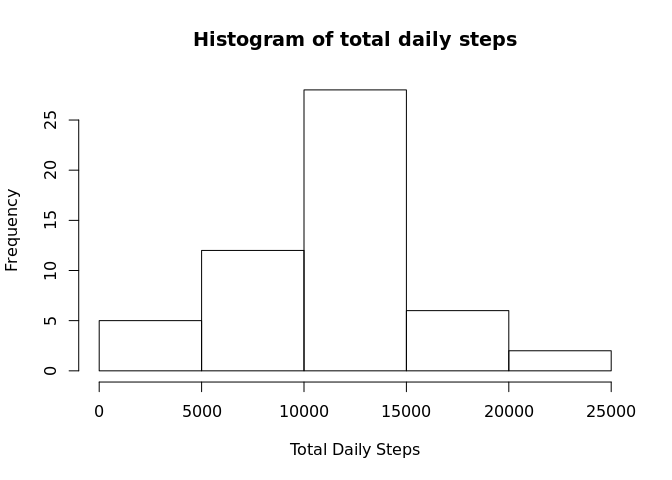
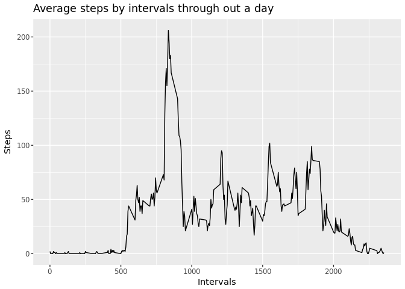
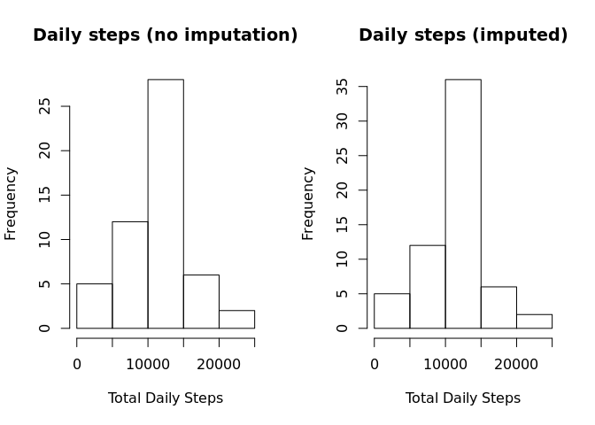
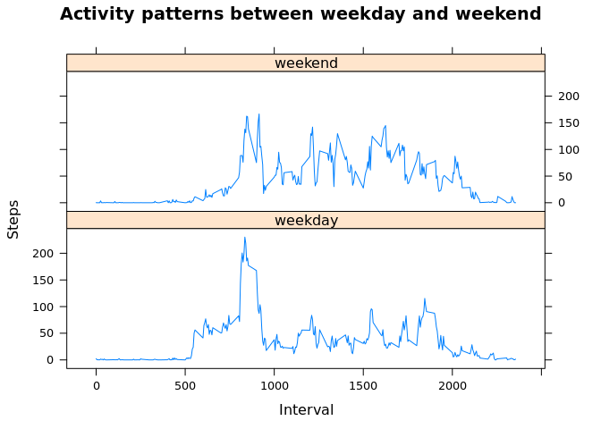

# Reproducible Research: Peer Assessment 1


## Loading and preprocessing the data
This Rmd file should be placed with activity.zip file so it runs properly.

```r
setwd("~/course/ds_coursera/course5/project1/RepData_PeerAssessment1")
unzip("activity.zip")
df <- read.csv("activity.csv", header=TRUE, na.strings="NA")
str(df)
```

```
## 'data.frame':	17568 obs. of  3 variables:
##  $ steps   : int  NA NA NA NA NA NA NA NA NA NA ...
##  $ date    : Factor w/ 61 levels "2012-10-01","2012-10-02",..: 1 1 1 1 1 1 1 1 1 1 ...
##  $ interval: int  0 5 10 15 20 25 30 35 40 45 ...
```

```r
head(df)
```

```
##   steps       date interval
## 1    NA 2012-10-01        0
## 2    NA 2012-10-01        5
## 3    NA 2012-10-01       10
## 4    NA 2012-10-01       15
## 5    NA 2012-10-01       20
## 6    NA 2012-10-01       25
```

```r
dim(df)
```

```
## [1] 17568     3
```

```r
total.days <- length(unique(df$date))
total.days
```

```
## [1] 61
```

```r
intervals.per.day <- length(unique(df$interval))
intervals.per.day
```

```
## [1] 288
```
After loading data, we had a quick check to variables and first 6 obeservations. Also we know that  there are **61** days observations and **288** intervals per day.

## What is mean total number of steps taken per day?
The total number of steps taken per day is calculated by adding all the steps in each day. We have a histogram plot to show the total number of steps taken per day.

```r
steps.by.day <- aggregate(steps ~ date, data=df, FUN=sum)
hist(steps.by.day$steps, xlab="Total Daily Steps", main="Histogram of total daily steps")
```

<!-- -->

Following we'll calculate mean and median to the total number of steps taken per day.

```r
mymean <- as.integer(mean(steps.by.day$steps, na.rm = TRUE))
mymedian <- median(steps.by.day$steps, na.rm = TRUE)
```
We find mean is **10766** and median is **10765**.


## What is the average daily activity pattern?
We will get the steps from the same interval across all days and average them. And we'll plot using a line chart to see what is the steps pattern through out a day.

```r
steps.mean.by.interval <- aggregate(steps~interval, data=df, mean, na.rm=TRUE)
steps.mean.by.interval$steps <- round(steps.mean.by.interval$steps)

library(ggplot2)
ggplot(steps.mean.by.interval, aes(interval, steps)) + 
    geom_line() +
    ggtitle("Average steps by intervals through out a day") +
    xlab("Intervals") +
    ylab("Steps")
```

<!-- -->

```r
max.interval.steps <- max(steps.mean.by.interval$steps)
max.interval <- steps.mean.by.interval$interval[steps.mean.by.interval$steps == max.interval.steps]
max.interval <- as.character(max.interval)
```
Also we find that the interval that contains the max number of steps is **835**. And the max steps is 206

## Imputing missing values
So first we'll need to find out what values are missing. From using anyNA we know **only steps column** has missing values.

```r
anyNA(df$steps)
```

```
## [1] TRUE
```

```r
anyNA(df$date)
```

```
## [1] FALSE
```

```r
anyNA(df$interval)
```

```
## [1] FALSE
```

And now let's count up how many NAs in steps.

```r
na.vector <- is.na(df$steps)
na.number <- sum(na.vector)
na.percentage <- mean(na.vector)
na.percentage2 <- as.numeric(format(round(na.percentage, 2), nsmall = 2)) * 100
```
Ok, there are 2304 NAs in steps column and the missing value percentage is 13% (0.1311475). We might need to do some imputation.

First we'll need to find some more information about the missing steps.

```r
library(dplyr)
```

```
## 
## Attaching package: 'dplyr'
```

```
## The following objects are masked from 'package:stats':
## 
##     filter, lag
```

```
## The following objects are masked from 'package:base':
## 
##     intersect, setdiff, setequal, union
```

```r
steps.group.by.date <- group_by(df, date)
na.number.summarize.by.date <- summarize(steps.group.by.date, na.number=sum(is.na(steps)))
na.number.summarize.by.date <- as.data.frame(na.number.summarize.by.date)
table(na.number.summarize.by.date$na.number)
```

```
## 
##   0 288 
##  53   8
```
Hmm...now we know there are 8 days that have all their steps missing and those are all the NAs steps in the whole data set. The rest of 53 days have no NAs in their steps at all. (We already know there are 61 days observations and 288 intervals per day.)

Let's find which days are they.

```r
na.days <- which(na.number.summarize.by.date$na.number == 288)
na.date <- as.character(na.number.summarize.by.date[na.days, "date"])
na.date
```

```
## [1] "2012-10-01" "2012-10-08" "2012-11-01" "2012-11-04" "2012-11-09"
## [6] "2012-11-10" "2012-11-14" "2012-11-30"
```

We'll need to impute steps for above dates and I'll calculate the mean of each interval across all the days for the missing steps. I'll create a new data frame after imutation.


```r
mean.by.interval <- aggregate(steps~interval, data=df, mean, na.rm=TRUE)
df2 <- mutate(df, mymutate=ifelse(is.na(steps), mean.by.interval$steps, steps))
df2$mymutate <- round(df2$mymutate)
df2$steps <- df2$mymutate
df2 <- df2[,-4]

anyNA(df2)
```

```
## [1] FALSE
```
Ok, so now there are no NAs in this new data frame.

We'll calculate histogram, mean and median after imutation for a comparison.

```r
steps.by.day2 <- aggregate(steps ~ date, data=df2, FUN=sum)

par(mfrow=c(1,2))
hist(steps.by.day$steps, xlab="Total Daily Steps", main="Daily steps (no imputation)")
hist(steps.by.day2$steps, xlab="Total Daily Steps", main="Daily steps (imputed)")
```

<!-- -->

```r
par(mfrow=c(1,1))

mymean2 <- as.integer(mean(steps.by.day2$steps))
mymedian2 <- as.integer(median(steps.by.day2$steps))
```
With missing steps, the mean of total daily steps is **10766**, median is  **10765**.  
After imutation, the mean of total dayly steps is **10765**, median is **10762**.   
So we can see after imputation, the mean and median are all down a bit but not much.


## Are there differences in activity patterns between weekdays and weekends?
First we'll need to create a new column to indicate weekday or weekend to each observation in above data
set.

```r
weekend <- c("Saturday", "Sunday")
df2$date <- as.Date(as.character(df2$date), "%Y-%m-%d")

df2 <- mutate(df2, wd=ifelse(weekdays(df2$date) %in% weekend, "weekend", "weekday"))
df2$wd <- as.factor(df2$wd)
```

Second, we'll do aggregation based on weekday or weekend and calculate average steps to each intervals.

```r
steps.mean.by.interval.weekday <- aggregate(steps~interval+wd, data=df2, mean, na.rm=TRUE)
```

Last we'll use xyplot to compare the activity patterns between weekdays and weekends.

```r
library(lattice)
xyplot(steps ~ interval|wd, data=steps.mean.by.interval.weekday, type="l", layout=c(1,2), 
       xlab="Interval",
       ylab="Steps",
       main="Activity patterns between weekday and weekend")
```

<!-- -->
    

From above plots, we may be able to tell that morning steps peaks from weekday are a bit higher than those in weekend while weekend sees more afternoon steps on average.


